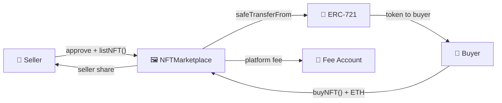

# 🖼️ Marketplace

[](https://github.com/noelialuz/Marketplace)
[](https://soliditylang.org/)
[](https://opensource.org/licenses/MIT)
[](https://ethereum.org/)
[](https://getfoundry.sh/)

> **A minimal Solidity NFT marketplace where sellers list ERC-721 tokens for ETH, buyers purchase them in a single transaction, and the contract collects a configurable platform fee.**

Marketplace is a learning-oriented Foundry project built around a single **`NFTMarketplace`** contract. Sellers approve the marketplace, list an NFT at a fixed price, and buyers pay the exact listing amount in native ETH. The contract transfers the NFT via **`safeTransferFrom`**, splits payment between the seller and a fee account, and protects write paths with **OpenZeppelin ReentrancyGuard**.

**Key features:**

- 🏷️ **`listNFT`** — list any ERC-721 token at a fixed ETH price
- 💰 **`buyNFT`** — pay exact listing price; NFT and funds settle atomically
- ✏️ **`updatePrice`** — seller updates an active listing price
- ❌ **`cancelList`** — seller removes their own listing
- 🧹 **`removeStaleListing`** — anyone can clear listings when ownership or approval is no longer valid
- 💸 Configurable **platform fee** (basis points, max 10%) sent to `feeAccount`
- 🛡️ **ReentrancyGuard** on all state-changing functions
- 📣 Events for list, buy, cancel, price update, and fee configuration changes
- 🧪 Foundry test suite with **27 unit tests** and a mock ERC-721

---

## 📋 Table of Contents

1. [Prerequisites & Dependencies](#-prerequisites--dependencies)
2. [Technologies & Versions](#-technologies--versions)
3. [Project Structure](#-project-structure)
4. [Quick Start](#-quick-start)
5. [Testing the Contract](#-testing-the-contract)
6. [Architecture](#-architecture)
7. [Security Policy](#-security-policy)
8. [Scripts & Commands](#-scripts--commands)
9. [Versioning](#-versioning)
10. [License](#-license)
11. [About the Author](#-about-the-author)

---

## 📦 Prerequisites & Dependencies

### System requirements

| Requirement | Notes |
| :-- | :-- |
| 🖥️ **OS** | macOS, Linux, or Windows |
| 🔧 **Git** | Required for cloning and submodules |
| ⚒️ **Foundry** | `forge`, `cast`, and `anvil` for build and test |

**Quick minimum:** [Foundry](https://getfoundry.sh/) installed and Solidity compiler **0.8.35**.

### Install Foundry

```bash
curl -L https://foundry.paradigm.xyz | bash
foundryup
```

Verify:

```bash
forge --version
cast --version
```

### Project dependencies

| Dependency | Role |
| :-- | :-- |
| [forge-std](https://github.com/foundry-rs/forge-std) | Foundry testing utilities and cheatcodes |
| [OpenZeppelin Contracts](https://github.com/OpenZeppelin/openzeppelin-contracts) | `IERC721`, `ReentrancyGuard`, and `ERC721` (test mock) |

After cloning, install submodules if needed:

```bash
git clone https://github.com/noelialuz/Marketplace.git
cd Marketplace
forge install
```

---

## 🛠 Technologies & Versions

| Technology | Version | Role |
| :-- | :-- | :-- |
| **Solidity** | `0.8.35` | Smart contract language |
| **Foundry** | latest (`foundryup`) | Build, test, and CLI interaction |
| **OpenZeppelin Contracts** | vendored in `lib/` | ERC-721 interface and reentrancy protection |
| **EVM** | — | Execution environment (Ethereum-compatible chains) |
| **SPDX** | `MIT` | License identifier in source |

---

## 📁 Project Structure

```bash
Marketplace/
├── foundry.toml                    # Foundry configuration
├── README.md                       # Project documentation
├── lib/
│   ├── forge-std/                  # Foundry standard library
│   └── openzeppelin-contracts/     # OpenZeppelin (IERC721, ReentrancyGuard)
├── src/
│   └── NFTMarketplace.sol          # Main marketplace contract
├── test/
│   └── NFTMarketplace.t.sol        # Unit tests + MockNFT
└── .vscode/                        # Editor settings (optional)
```

This repository is a **Foundry-first** project. NFT collections are external ERC-721 contracts — the marketplace does not mint tokens; it only facilitates peer-to-peer sales.

---

## 🚀 Quick Start

### 1. Clone and build

```bash
git clone https://github.com/noelialuz/Marketplace.git
cd Marketplace
forge build
```

### 2. Deploy

Deploy `NFTMarketplace` with a fee recipient address and fee rate in **basis points** (1 bp = 0.01%).

| Field | Description | Example |
| :-- | :-- | :-- |
| **Contract** | `NFTMarketplace` | — |
| **`feeAccount_`** | Address that receives platform fees | `0x...` |
| **`feePercent_`** | Fee in basis points (`250` = 2.5%, max `1000` = 10%) | `250` |

Using Foundry (local Anvil node):

```bash
anvil &
forge create src/NFTMarketplace.sol:NFTMarketplace \
  --rpc-url http://127.0.0.1:8545 \
  --private-key <DEPLOYER_PRIVATE_KEY> \
  --constructor-args <FEE_ACCOUNT_ADDRESS> 250
```

The deployer becomes the contract **`owner`** and can later call `setFeeAccount` and `setFeePercent`.

### 3. List and buy an NFT

```solidity
// 1. Seller approves the marketplace (single token or setApprovalForAll).
IERC721(nftAddress).approve(marketplaceAddress, tokenId);
// or: IERC721(nftAddress).setApprovalForAll(marketplaceAddress, true);

// 2. Seller lists the NFT at a fixed ETH price.
marketplace.listNFT(nftAddress, tokenId, priceInWei);

// 3. Buyer pays the exact listing price.
marketplace.buyNFT{value: priceInWei}(nftAddress, tokenId);
// NFT goes to buyer; seller and fee account receive ETH.
```

**Fee example:** with `feePercent = 250` (2.5%) and a sale price of `1 ETH`:

| Recipient | Amount |
| :-- | :-- |
| Seller | `0.975 ETH` |
| Fee account | `0.025 ETH` |

---

## 🧪 Testing the Contract

### Run the full test suite

All tests run locally against a mock ERC-721 — no fork or RPC URL required:

```bash
forge test -vv
```

Expected: **27 tests passed** covering listing, buying, fees, price updates, cancellation, stale listing cleanup, and owner-only fee configuration.

### Verbose output for a specific test

```bash
forge test -vvvv --match-test testShouldBuyNFTCorrectlyWithFees
```

### What the tests cover

| Area | Tests |
| :-- | :-- |
| **Listing** | Price validation, ownership, approval, `setApprovalForAll` |
| **Buying** | Exact payment, fee split, NFT transfer to buyer |
| **Cancellation** | Seller-only cancel, listing cleared from storage |
| **Price updates** | Seller updates price; reverts for zero or non-owner |
| **Stale listings** | Removal when owner changed or approval revoked |
| **Fee admin** | Constructor validation, `setFeeAccount`, `setFeePercent`, owner checks |

### Manual interaction with `cast`

After deploying on a testnet or local node:

```bash
# List an NFT (seller)
cast send $MARKETPLACE \
  "listNFT(address,uint256,uint256)" \
  $NFT $TOKEN_ID $PRICE \
  --private-key $SELLER_PK

# Buy an NFT (buyer — value must match listing price exactly)
cast send $MARKETPLACE \
  "buyNFT(address,uint256)" \
  $NFT $TOKEN_ID \
  --value $PRICE \
  --private-key $BUYER_PK

# Cancel a listing (seller)
cast send $MARKETPLACE \
  "cancelList(address,uint256)" \
  $NFT $TOKEN_ID \
  --private-key $SELLER_PK
```

### Remix (optional)

1. Copy [`src/NFTMarketplace.sol`](./src/NFTMarketplace.sol) into Remix.
2. Add OpenZeppelin imports via Remix GitHub import or flatten the contract.
3. Compile with Solidity **0.8.35**.
4. Deploy with your `feeAccount` address and fee basis points (e.g. `250`).
5. Approve the deployed marketplace from an ERC-721 contract, then call `listNFT` and `buyNFT`.

---

## 🗄 Architecture

The marketplace sits between sellers, buyers, and any standard ERC-721 collection:



### Contract responsibilities

| Contract | Responsibility |
| :-- | :-- |
| **`NFTMarketplace`** | Stores listings, validates ownership/approval, executes sales, splits ETH |
| **External ERC-721** | NFT collection; must implement standard `approve` / `transfer` interfaces |

### Core state

| Variable | Visibility | Description |
| :-- | :-- | :-- |
| `owner` | `public` | Deployer; can update fee settings |
| `feeAccount` | `public` | Address that receives platform fees |
| `feePercent` | `public` | Fee in basis points (denominator `10000`) |
| `listing` | `public` | `mapping(nftAddress => mapping(tokenId => Listing))` |

### `Listing` struct

| Field | Type | Description |
| :-- | :-- | :-- |
| `seller` | `address` | Account that listed the NFT |
| `nftAddress` | `address` | ERC-721 contract address |
| `tokenId` | `uint256` | Token identifier |
| `price` | `uint256` | Sale price in wei |

### Write functions

| Function | Access | Description |
| :-- | :-- | :-- |
| `listNFT(address nftAddress_, uint256 tokenId_, uint256 price_)` | `external` | Create a listing; caller must own the NFT and approve the marketplace |
| `buyNFT(address nftAddress_, uint256 tokenId_)` | `external payable` | Pay exact listing price; NFT and ETH settle in one transaction |
| `cancelList(address nftAddress_, uint256 tokenId_)` | `external` | Seller removes their listing |
| `updatePrice(address nftAddress_, uint256 tokenId_, uint256 newPrice_)` | `external` | Seller updates listing price |
| `removeStaleListing(address nftAddress_, uint256 tokenId_)` | `external` | Clear listing if seller no longer owns or approved the NFT |
| `setFeeAccount(address feeAccount_)` | `external` | Owner updates fee recipient |
| `setFeePercent(uint256 feePercent_)` | `external` | Owner updates fee rate (max 1000 bp = 10%) |

### Events

```solidity
event NFTListed(address indexed seller, address indexed nftAddress, uint256 indexed tokenId, uint256 price);
event NFTCancelled(address indexed seller, address indexed nftAddress, uint256 indexed tokenId);
event NFTSold(address indexed buyer, address indexed seller, address indexed nftAddress, uint256 tokenId, uint256 price);
event NFTPriceUpdated(address indexed seller, address indexed nftAddress, uint256 indexed tokenId, uint256 newPrice);
event FeeAccountChanged(address indexed oldAccount, address indexed newAccount);
event FeePercentChanged(uint256 oldPercent, uint256 newPercent);
```

### Sale flow

1. **Approve** — Seller grants the marketplace single-token or operator approval on the ERC-721.
2. **List** — Seller calls `listNFT` with a price greater than zero; listing is stored on-chain.
3. **Buy** — Buyer sends exactly `listing.price` wei via `buyNFT`.
4. **Settle** — Listing is deleted; NFT transfers to buyer; fee and seller shares are sent via low-level calls.
5. **Event** — `NFTSold` logs buyer, seller, token, and price.

### Fee calculation

```
feeAmount   = (msg.value * feePercent) / 10000
sellerAmount = msg.value - feeAmount
```

---

## 🔐 Security Policy

> ⚠️ **This project is intended for learning and demonstration purposes only.** It has **not** undergone a professional security audit.

### Known considerations

| Area | Detail |
| :-- | :-- |
| 🎓 **Educational scope** | Not production-ready; use at your own risk |
| 🔗 **External NFT trust** | Sales depend on the behavior of the listed ERC-721 contract |
| 💸 **Native ETH only** | No ERC-20 payment support; buyers must send exact wei |
| ⏱️ **No offer / auction model** | Fixed-price listings only; no bids or timed auctions |
| 🔓 **Approval required** | Sellers must keep marketplace approval valid until sale or cancel |
| 🧹 **Stale listings** | `removeStaleListing` allows cleanup but does not enforce it automatically |
| 👤 **Single owner** | Fee settings controlled by one `owner` address; no multisig or timelock |
| 📞 **Low-level ETH transfers** | Seller and fee payouts use `.call{value:}`; recipient contracts must handle ETH safely |
| 🧪 **Test first** | Run the full test suite and validate on a testnet before mainnet |

### Before using in production

- [ ] Review all logic in [`src/NFTMarketplace.sol`](./src/NFTMarketplace.sol)
- [ ] Run `forge test` and extend coverage for your target NFT standards
- [ ] Consider a professional audit
- [ ] Add pausing, access control upgrades, or royalty (EIP-2981) support if needed
- [ ] Validate fee account is a secure, non-reverting recipient

### Reporting vulnerabilities

If you discover a security issue, please **do not** open a public GitHub issue. Contact the repository owner directly (see [About the Author](#-about-the-author)).

Smart contracts carry inherent technical and financial risk. Use this repository at your own responsibility.

---

## 📜 Scripts & Commands

| Command | Description |
| :-- | :-- |
| `forge build` | Compile contracts |
| `forge test -vv` | Run all 27 unit tests |
| `forge test -vvvv --match-test <TEST_NAME>` | Verbose run for a single test |
| `forge create src/NFTMarketplace.sol:NFTMarketplace --constructor-args <FEE_ACCOUNT> <FEE_BPS>` | Deploy via CLI |
| `anvil` | Start a local Ethereum node |
| `forge fmt` | Format Solidity sources |
| `cast send ... "listNFT(...)"` / `"buyNFT(...)"` | Interact with a deployed marketplace |

---

## 📌 Versioning

This project follows **[Semantic Versioning 2.0.0](https://semver.org/)**:

| Segment | Meaning |
| :-- | :-- |
| **MAJOR** | Breaking changes to contract interface or behavior |
| **MINOR** | New features, backward-compatible |
| **PATCH** | Bug fixes, docs, no breaking API changes |

### Release history

| Version | Status | Notes |
| :-- | :-- | :-- |
| **0.1.0** | Current | Initial release: `NFTMarketplace`, fee support, stale listing cleanup, Foundry tests |

Tag releases on GitHub:

```bash
git tag -a v0.1.0 -m "Initial NFTMarketplace release with fee support and full test suite"
git push origin v0.1.0
```

---

## 📄 License

Marketplace is released under the **MIT License** — see the SPDX header in [`src/NFTMarketplace.sol`](./src/NFTMarketplace.sol).

SPDX identifier: `// SPDX-License-Identifier: MIT`

---

## 👤 About the Author

| | |
| :-- | :-- |
| **Name** | Noelia Luz Fernández |
| **GitHub** | [@Noelialuz](https://github.com/noelialuz) |
| **LinkedIn** | https://www.linkedin.com/in/noelia-luz-fernandez-03404440/ |
| **Email** | noelia_luz_fernandez@hotmail.com |

---

## 📚 Learn More

- [Foundry Book](https://book.getfoundry.sh/) — CLI testing, forking, and cheatcodes
- [OpenZeppelin ERC-721](https://docs.openzeppelin.com/contracts/api/token/erc721) — NFT standard and safe transfers
- [OpenZeppelin ReentrancyGuard](https://docs.openzeppelin.com/contracts/api/utils#ReentrancyGuard) — reentrancy protection patterns
- [EIP-721](https://eips.ethereum.org/EIPS/eip-721) — non-fungible token standard
- [Solidity documentation](https://docs.soliditylang.org/) — language reference and best practices
